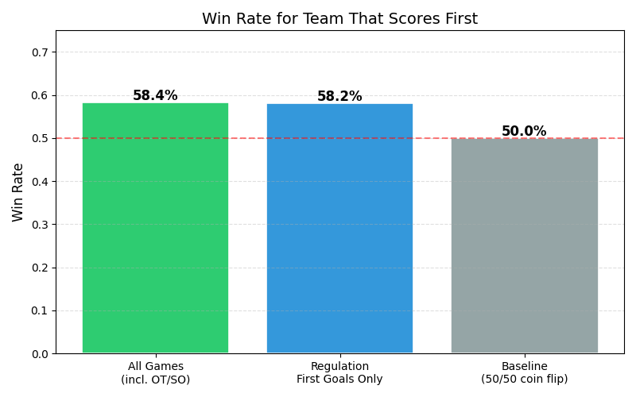
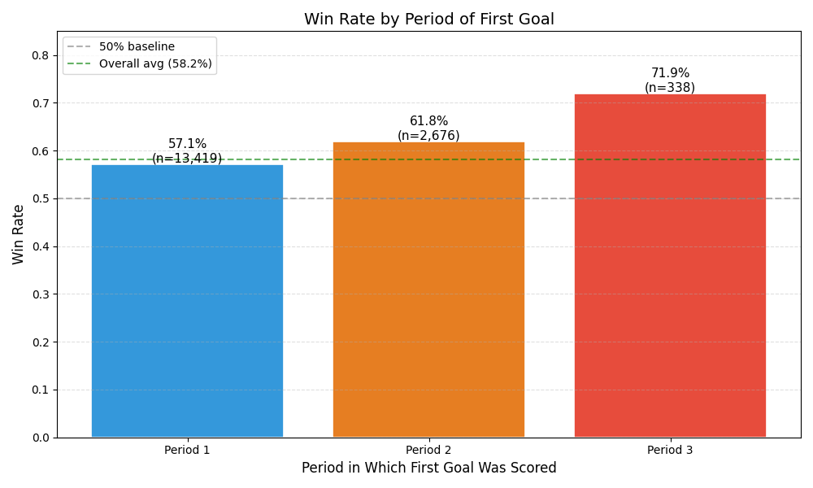
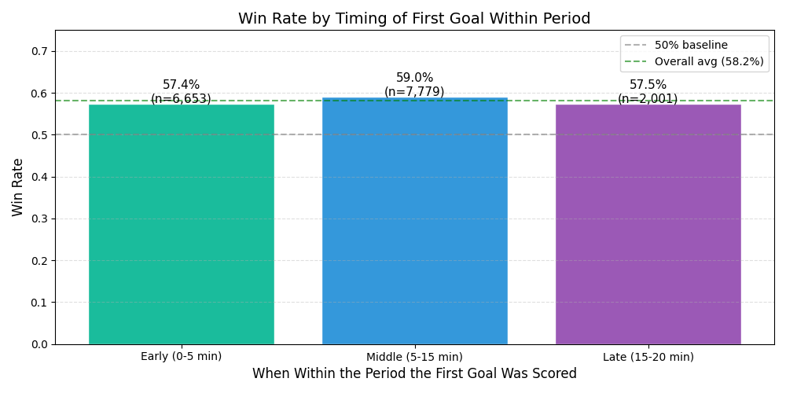
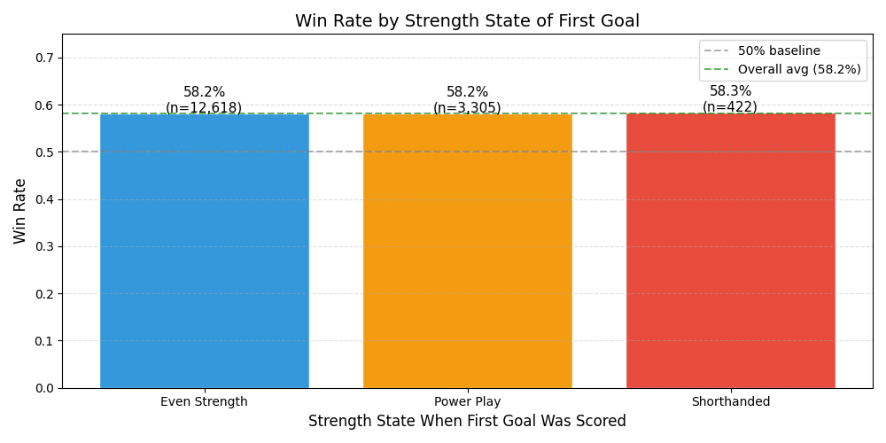
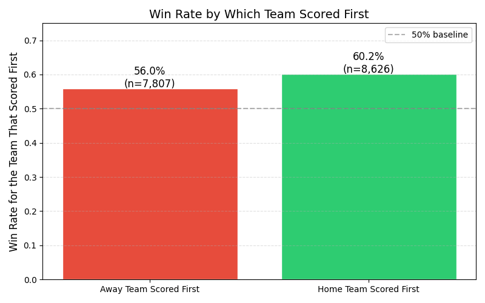
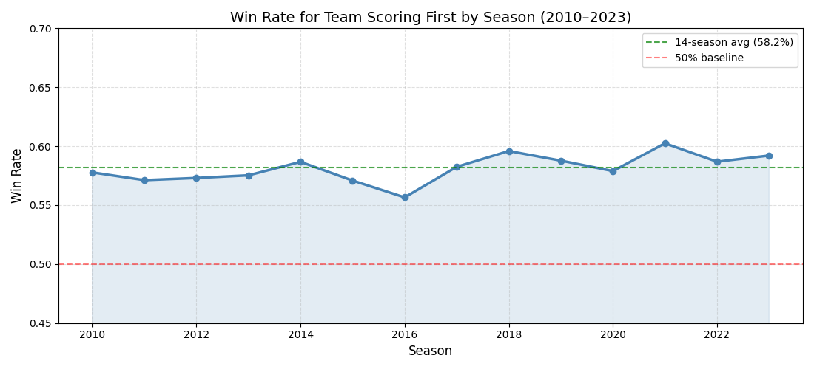
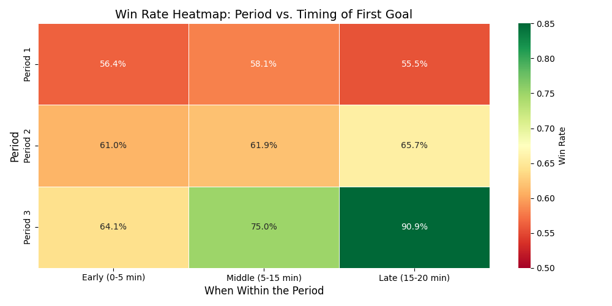
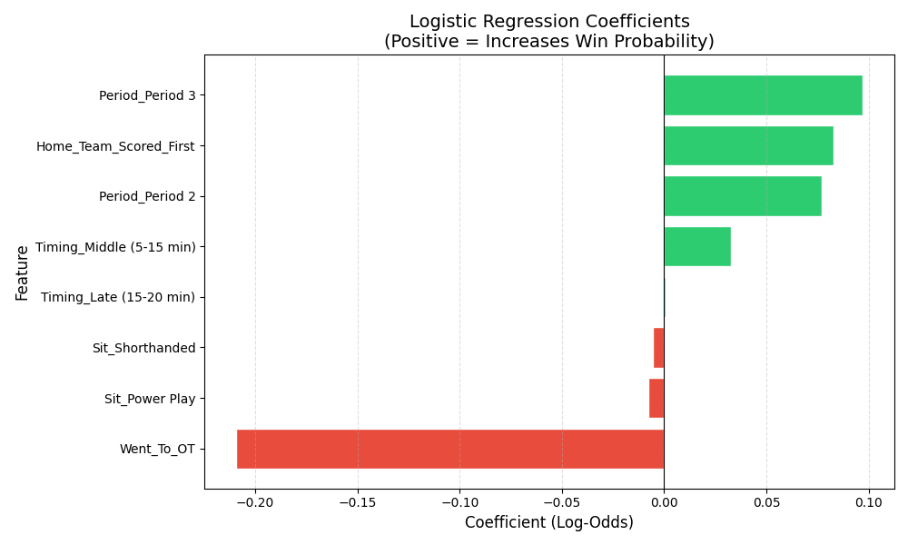
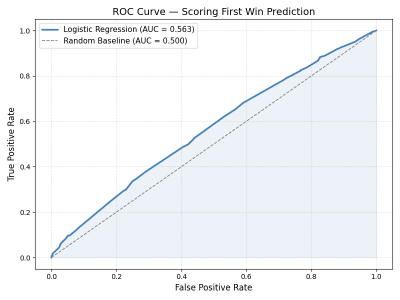

# NHL Scoring First — Does It Actually Win Games?

"Scoring first wins games" is one of the most repeated phrases in hockey. Coaches say it before every game. Broadcasters reference it after every first goal. This project uses 16,500+ regular season NHL games from 2010 to 2023 to test that claim — and finds that while the cliché is true, it is weaker than most people assume, and *when* you score first matters far more than the goal itself.

---

## What This Project Does

For every regular season NHL game from 2010 to 2023, I identified the first goal scored, extracted the full game context around it (period, timing, strength state, home/away), and tracked whether the team that scored first ultimately won. The analysis works through three layers:

1. **Exploratory Data Analysis** — Win rates broken down by period, timing, strength state, home/away, and season trend
2. **Chi-Square Testing** — Determines which factors are statistically significant vs. noise
3. **Logistic Regression Model** — Quantifies exactly how much each factor shifts win probability, with a win probability calculator for any game scenario

Unlike the Random Forest models in the goalie pull and fight momentum projects, logistic regression produces real, interpretable coefficients — so the model output is an actual equation, not a black box.

---

## Project Structure

```
NHL-Scoring-First/
├── data/
│   └── NHL_Scoring_First_Data.csv
├── notebooks/
│   ├── scoring_first_data_extraction.ipynb
│   └── scoring_first_analysis.ipynb
├── outputs/
│   ├── Overall_Win_Rate.png
│   ├── Win_Rate_By_Period.png
│   ├── Win_Rate_By_Timing.png
│   ├── Win_Rate_By_Situation.png
│   ├── Win_Rate_By_Venue.png
│   ├── Win_Rate_By_Season.png
│   ├── Win_Rate_Heatmap.png
│   ├── Logistic_Regression_Coefficients.png
│   └── ROC_Curve.png
├── .gitignore
├── requirements.txt
└── README.md
```

---

## Data

The raw play-by-play data covers NHL seasons from 2010 to 2023 and comes from [hockey-statistics.com](https://hockey-statistics.com/data/). The raw file is around 513MB and is not included in this repository. Download it from that link, place it in the `data/` folder, and run `scoring_first_data_extraction.ipynb` to generate the cleaned game-level CSV.

The cleaned output file (`NHL_Scoring_First_Data.csv`) is already included so you can go straight to the analysis notebook.

**Key methodology note:** Overtime and shootout first goals are excluded from the main analysis. A first goal in overtime always ends the game, so including them artificially inflates win rates and distorts the model. The dataset covers 16,433 regulation first goals across 16,528 total games.

---

## Features

| Feature | Description |
|---|---|
| `First_Goal_Period` | Which period the first goal was scored in (1, 2, or 3) |
| `First_Goal_Timing` | Early (0–5 min), Middle (5–15 min), or Late (15–20 min) within the period |
| `First_Goal_Situation` | Even Strength, Power Play, or Shorthanded |
| `Home_Team_Scored_First` | 1 if the home team scored first, 0 if the away team |
| `Time_Into_Period` | Exact seconds elapsed in the period when the first goal was scored |
| `Final_Score_Margin` | Goal differential at the end of the game |
| `Went_To_OT` | Whether the game went to overtime |
| `First_Goal_Team_Won` | Target variable — did the team that scored first win? |

---

## Exploratory Data Analysis

**The cliché is true — but weaker than advertised**

The team that scores first wins 58.2% of the time in regulation. That is a real and meaningful advantage over the 50% baseline, but far from the dominant edge the phrase implies. A coin weighted slightly in your favor is still mostly a coin flip.



**Period matters far more than most people assume**

This is the headline finding. Win rate climbs significantly with each passing period:

| Period | Win Rate | Games |
|---|---|---|
| Period 1 | 57.1% | 13,419 |
| Period 2 | 61.9% | 2,676 |
| Period 3 | 71.9% | 338 |

A first goal in the 3rd period wins nearly 72% of the time — nearly 15 points higher than a 1st period first goal. When broadcasters say "scoring first wins games," they are mostly describing what happens when teams score first late in games.



**Timing within the period does not matter**

Whether the first goal came early, middle, or late within a period made almost no difference to win rate (57.4%, 59.0%, 57.5% respectively). The conventional wisdom that an early goal "sets the tone for the period" is not supported by the data.



**Strength state has virtually no effect**

This is the most surprising finding. A shorthanded goal, a power play goal, and an even strength goal all produce nearly identical win rates (58.2%, 58.2%, 58.3%). The dramatic momentum shift everyone attributes to a shorthanded goal in particular does not show up in final outcome data.



**Home teams have a modest but real advantage**

When the home team scores first they win 60.2% of the time. When the away team scores first, the away team wins 56.0% of the time — a gap of about 4 percentage points that is statistically significant but not as large as crowd energy narratives would suggest.



**The effect has been stable but slightly increasing since 2016**

Win rates fluctuate year to year but have trended slightly upward since 2016, suggesting teams may be getting marginally better at protecting early leads — possibly reflecting the broader analytical emphasis on defensive structure and shot suppression.



**Period and timing combined — the full picture**

The heatmap shows every combination of period and timing. The strongest win rates appear in the late 3rd period regardless of timing, while 1st period goals show the least advantage across all timing windows.



---

## Statistical Testing

A **chi-square test of independence** was used to determine whether each factor significantly affects win rate. Chi-square is the appropriate test for binary outcomes (win/loss) across categorical groups, unlike a t-test which is used for continuous outcomes.

| Factor | Chi-Square | P-Value | Significant? |
|---|---|---|---|
| Period of first goal | 47.36 | <0.0001 | Yes |
| Home/Away | 29.76 | <0.0001 | Yes |
| Timing within period | 4.58 | 0.1013 | No |
| Strength state | 0.003 | 0.9983 | No |

Period and home/away are both highly significant. Timing and strength state are not — meaning two of the most commonly cited factors in hockey commentary have no statistically meaningful impact on whether the first goal leads to a win.

---

## Logistic Regression Model

A logistic regression model was used rather than Random Forest for a specific reason: it produces real, interpretable coefficients. The win probability for any game scenario can be calculated directly from the equation:

**P(Win) = 1 / (1 + e^-(0.3445 + 0.097\*Period3 + 0.083\*HomeScored + 0.077\*Period2 + 0.033\*MiddleTiming - 0.209\*WentToOT))**

**Model Performance**

| Metric | Value |
|---|---|
| Accuracy | 58.0% |
| ROC-AUC (test set) | 0.563 |
| ROC-AUC (5-fold CV) | 0.565 |

An AUC of 0.563 is intentionally honest — first goal context alone is not a strong predictor of who wins. The game is more unpredictable than the cliché suggests, and the model reflects that rather than overfitting to noise.

**Coefficient Rankings**

| Feature | Coefficient | Odds Ratio | Interpretation |
|---|---|---|---|
| Period 3 first goal | +0.097 | 1.10 | Strongest positive effect |
| Home team scored first | +0.083 | 1.09 | Second strongest |
| Period 2 first goal | +0.077 | 1.08 | Moderate positive effect |
| Middle timing | +0.033 | 1.03 | Marginal effect |
| Late timing | +0.000 | 1.00 | Essentially no effect |
| Shorthanded goal | -0.006 | 0.99 | No meaningful effect |
| Power play goal | -0.008 | 0.99 | No meaningful effect |
| Went to OT | -0.209 | 0.81 | Strongest negative effect |





**Win Probability Calculator**

The analysis notebook includes a calculator that takes any game scenario and returns the predicted win probability:

| Scenario | Win Probability |
|---|---|
| Late 3rd period goal, home team | 75.9% |
| Early 3rd period goal, away team | 72.7% |
| 2nd period goal, power play, home team | 67.2% |
| Early 1st period goal, home team | 61.4% |
| Early 1st period goal, shorthanded, away team | 56.5% |
| Early 1st period goal, away team | 57.3% |

The gap between best and worst case is about 18 percentage points — meaningful but not as dramatic as the cliché implies.

---

## Key Findings

The conventional wisdom is directionally correct but overstated. Scoring first gives you a 58% chance of winning — real, but not dominant.

The two factors that actually matter are **period** and **home/away status**, both statistically significant at p<0.0001. The two factors everyone talks about — whether it was a power play or shorthanded goal, and whether it came early in the period — have no statistically significant effect on the final outcome.

The most actionable takeaway: a first goal in the 3rd period is worth nearly three times the narrative weight of a first goal in the 1st period, but coaches and broadcasters rarely draw that distinction.

---

## How to Run

Install dependencies:
```bash
pip install -r requirements.txt
```

Run the notebooks in order. Start with `scoring_first_data_extraction.ipynb` if you have the raw CSV, or go straight to `scoring_first_analysis.ipynb` using the pre-processed data file already in `data/`.

---

## Requirements

```
pandas
numpy
matplotlib
seaborn
scipy
scikit-learn
```

---

## Author

[Your Name] — connect with me on [LinkedIn](https://www.linkedin.com/in/your-profile)
